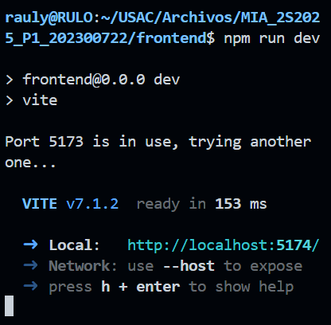

### Universidad de San Carlos de Guatemala
### Facultad de ingeniería
### Laboratorio Manejo e Implementación de Archivos
### Sección D
### Auxiliar: Kevin Martin Samayoa Urizar

#### PROYECTO # 2

#### GoDisk 2.0
#### Manual de Usuario

| Nombre| Carnet |
|---|---|
| Raúl Emanuel Yat Cancinos | 202300722

Bienvenido al Manual de Usuario del proyecto GoDisk, para empezar usted tiene que encender el frontend mediante el comando

Esto siempre y cuando usted esté en la carpeta Frontend.

Posteriormente le saldrá el siguiente mensaje:

Usted abre el link mediante la combinación de teclas CTRL + click y en su navegador se abrirá el frontend donde tendrá esta ventana.

Usted podrá observar que hay tres secciones, el área de comandos, el área de salida y el área de botones

En el área de Comandos usted podrá ingresar los comandos que están disponibles para ejecutar en el proyecto.

En el área de Salida usted podrá observar, luego de ejecutar los comandos, los mensajes que el programa depurará mediante cada comando.

En el área de botones, usted puede ejecutar los comandos que escribió en el área de comandos, usted puede limpiar tanto el área de comandos como el área de salida de todo texto, usted puede cargar un script con los comandos, puede iniciar sesión y cerrarla y puede acceder al sistema de archivos.

Cuando usted inicia sesión se presenta la siguiente pantalla, donde puede ingresar el nombre de usuario, la contraseña y el id de la partición de ello.

Cuando usted accede al sistema de archivos, usted de primero podrá seleccionar el disco junto con su información como el tamaño, el fit y las particiones que tiene formateadas.

Cuando seleccione el disco, la página lo llevara a escoger la partición formateada, donde de igual manera podrá observar la información de la mismo como el tamaño, el fit, el tipo y el estado.

Cuando usted selecciona la partición primero tuvo que haber iniciado sesión, con ello podrá observar el sistema de archivos de dicha partición, donde están los directorios y archivos.

Para que todo esto se ejecute de buena manera tiene que encender el backend, para ello, estando en la carpeta raiz, ejecute el siguiente comando

Para verificar que se encendió el Backend de buena manera, se mostrará este mensaje en consola de VSCode.

Si usted quiere apagar el backend o el frontend precisa de la combinación de teclas CTRL + C en la consola.