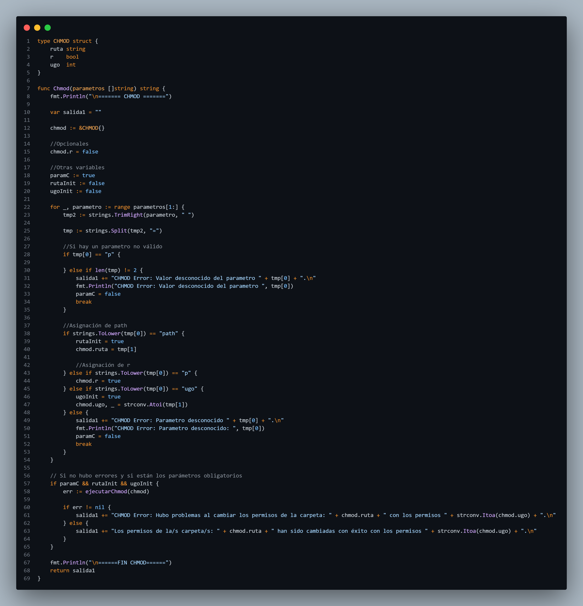

### Universidad de San Carlos de Guatemala
### Facultad de ingeniería
### Laboratorio Manejo e Implementación de Archivos
### Sección D
### Auxiliar: Kevin Martin Samayoa Urizar

#### PROYECTO # 2

#### GoDisk 2.0
#### Manual Técnico

| Nombre| Carnet |
|---|---|
| Raúl Emanuel Yat Cancinos | 202300722

## Descripción de la Arquitectura del Sistema

## Explicación de las Estructuras de Datos
#### MBR
El MBR es la primera estructura escrita en un disco .mia. Se ubica en el primer sector (inicio del archivo binario) y contiene la información general del disco y las particiones. Contiene los siguientes campos: 

#### Partición
Una partición es una división lógica dentro de un disco duro virtual (archivo .mia) que permite segmentar el espacio para simular múltiples unidades de almacenamiento independientes. Cada partición se comporta como un disco independiente dentro del sistema de archivos EXT2. Contiene los siguientes campos:

#### EBR
El EBR se utiliza para gestionar particiones lógicas dentro de una partición extendida. Funciona como una lista enlazada donde cada EBR apunta al siguiente. Contiene los siguientes campos:

#### Superbloque
El Superbloque es una estructura crítica que almacena información global sobre el sistema de archivos EXT2 en una partición. Se escribe una vez al formatear la partición con mkfs y contiene metadatos esenciales para su gestión. Contiene los siguientes campos:

#### Bitmap
Los bitmaps son estructuras que registran el estado de los inodos y bloques en la partición. Cada bit representa el estado de un recurso (0 = libre, 1 = ocupado).

Bitmap de Inodos: Indica qué inodos están libres o ocupados.
Bitmap de Bloques: Indica qué bloques (carpetas, archivos, apuntadores) están libres o ocupados.

#### Inodos
Los inodos son estructuras que almacenan metadatos de archivos y carpetas. Cada archivo o carpeta tiene exactamente un inodo que describe sus propiedades y apunta a los bloques que contienen sus datos.

#### Grupos y usuarios
El sistema de archivos EXT2 simulado incluye un sistema de usuarios y grupos para gestionar permisos de acceso a archivos y carpetas. Esta información se almacena en un archivo especial llamado users.txt ubicado en la raíz de cada partición formateada. Cada uno contienen los siguientes campos:
##### Usuario

##### Grupo

#### BlockFolder
Los bloques de carpeta son estructuras que almacenan la información de los archivos y subcarpetas contenidas dentro de una carpeta. Cada entrada en un bloque de carpeta relaciona un nombre con su correspondiente inodo. Contienen los siguientes campos:

#### BlockFile
Los bloques de archivo son estructuras que almacenan el contenido real de un archivo. Cada bloque de archivo puede contener hasta 64 bytes de datos.
Contienen los siguientes campos:

### Nueva estructura para el EXT3
Para cuando se hace un formateo EXT3 se agrega el journaling.
#### Journaling
El journaling en el sistema de archivos EXT3 es un mecanismo de registro por bitácora que garantiza la consistencia del sistema ante fallos inesperados (como cortes de energía o bloqueos del sistema), registrando primero las operaciones pendientes en una área especial llamada "journal" antes de ejecutarlas en el sistema de archivos principal, lo que permite recuperar rápidamente el sistema a un estado consistente mediante la repetición o reversión de operaciones incompletas registradas en este diario de transacciones.

## Explicación de los Comandos Implementados
#### Comando MKDISK
Crea un archivo binario (.mia) que simula un disco duro virtual.

#### Comando RMDISK
Elimina permanentemente un disco virtual (archivo .mia).

#### Comando FDISK
Administra particiones dentro de un disco virtual.

#### Comando MOUNT
Monta una partición en el sistema para su uso.

#### Comando MOUNTED
Lista todas las particiones montadas en el sistema.

#### Comando MKFS
Formatea una partición montada con el sistema de archivos EXT2.

#### Comando CAT
Muestra el contenido de uno o varios archivos.

#### Comando LOGIN
Inicia sesión en el sistema de archivos de una partición montada.

#### Comando LOGOUT
Cierra la sesión activa actual.

#### Comando MKGRP
Crea un nuevo grupo en el sistema de archivos.

#### Comando RMGRP
Elimina un grupo existente (borrado lógico).

#### Comando MKUSR
Crea un nuevo usuario en el sistema.

#### Comando RMUSR
Elimina un usuario existente (borrado lógico).

#### Comando CHGRP
Cambia el grupo de un usuario existente.

#### Comando MKDIR
Crea una nueva carpeta en el sistema de archivos.

#### Comando MKFILE
Crea un nuevo archivo en el sistema de archivos.

#### Comando REP
Genera reportes gráficos o textuales del sistema de archivos.

### Nuevos comandos
Los nuevos comandos implementados en este proyecto son:

#### Comando REMOVE
Elimina un archivo o directorio.

#### Comando EDIT
Edita el contenido de un archivo.

#### Comando RENAME
Cambia el nombre de un directorio o archivo

#### Comando COPY
Copia el contenido de un directorio o archivo en otra ruta destino.

#### Comando Move
Mueve el contenido de un directorio o archivo en otra ruta destino.

#### Comando FIND
Realiza la búsqueda de un directorio o archivo.

#### Comando CHOWN
Cambia los permisos que tiene un usuario.

#### Comando CHMOD
Cambia los permisos que tiene un directorio o carpeta.

#### Comando JOURNALING
Muestra el journaling.

#### Comando LOSS
Simula la pérdida de datos en el sistema de archivos.

#### Comando RECOVERY
Recupera los datos mediante el journaling en el sistema de archivos.

## Informe de impacto
El desarrollo del sistema GoDisk representa una contribución significativa en el ámbito educativo y técnico, al proporcionar una herramienta práctica para la comprensión y experimentación con sistemas de archivos EXT2. Este proyecto impacta directamente en la formación de estudiantes de ingeniería, permitiéndoles interactuar con conceptos complejos como la gestión de particiones, inodos, bloques y permisos en un entorno simulado pero realista. Al eliminar la dependencia de hardware físico y ofrecer una interfaz web accesible, se democratiza el acceso al conocimiento sobre estructuras de almacenamiento, beneficiando tanto a instituciones educativas como a profesionales que buscan profundizar en el funcionamiento interno de los sistemas de archivos.

Adicionalmente, GoDisk sienta las bases para futuras extensiones y adaptaciones en entornos de producción, como la implementación de sistemas de almacenamiento personalizados o la integración con tecnologías emergentes como contenedores y entornos cloud. La capacidad de generar reportes gráficos mediante Graphviz no solo facilita la depuración y el análisis técnico, sino que también promueve mejores prácticas de documentación y visualización de datos. Este proyecto no solo cumple con un objetivo académico, sino que también impulsa la innovación en el manejo de archivos a nivel de software, contribuyendo al ecosistema de herramientas de código abierto orientadas a la educación técnica especializada.

## Plan de mantenimiento
El sistema GoDisk requerirá un mantenimiento continuo para garantizar su funcionalidad, seguridad y adaptabilidad a futuros cambios tecnológicos. Se propone un modelo de mantenimiento correctivo y evolutivo, que incluirá la revisión periódica del código para corregir posibles errores no detectados durante la fase de desarrollo, así como la actualización de las dependencias del proyecto (frameworks frontend, librerías de Graphviz y el propio lenguaje Go). Se mantendrá un repositorio GitHub activo donde se documentarán incidencias, se gestionarán solicitudes de mejora y se publicarán actualizaciones de manera regular, asegurando la compatibilidad con las principales distribuciones GNU/Linux y versiones de navegadores web.

Adicionalmente, se planea expandir las capacidades del sistema mediante mejoras evolutivas, como la implementación de nuevos comandos (por ejemplo, para manipulación avanzada de permisos o soporte para otros sistemas de archivos), optimización del rendimiento en la gestión de discos de gran tamaño y la integración de APIs para exportación de datos. Se establecerá una documentación técnica detallada y actualizada que facilite la incorporación de nuevos desarrolladores al proyecto. El mantenimiento será responsabilidad de un equipo central, pero se fomentará la contribución de la comunidad mediante un código abierto bien documentado y pruebas automatizadas que validen cada nueva integración.